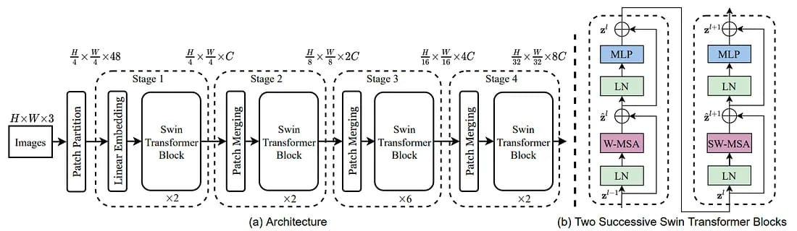

# Swin Transformer Model for Image Classification

This project implements an image classification model using the Swin Transformer architecture. The model is designed to handle an imbalanced dataset by utilizing class-weighted loss, and it is trained using the PyTorch framework.


Swin tranformer architecture:




## Project Structure
- **Training and Validation Data**: The dataset is loaded from folders containing images classified into different categories.
- **Model**: A pre-trained Swin Transformer model is fine-tuned for the specific classification task.
- **Loss Function**: The class imbalance is handled by applying class weights to the cross-entropy loss.
- **Optimizer**: The model is optimized using AdamW.
- **Data Augmentation**: A set of image transformations is applied to the training data to improve model robustness and generalization.


## Requirements
To install the required libraries, run:
``` bash
pip install torch torchvision timm scikit-learn tqdm pandas
```
## Dataset 
The training and validation dataset has been developed using
three publicly available (SEE-AI project dataset, KID,
and Kvasir-Capsule dataset) and one private dataset (AIIMS) VCE datasets. The training and validation dataset
consist of 37,607 and 16,132 VCE frames respectively mapped to 10 class labels namely angioectasia, bleeding, erosion, erythema, foreign body, lymphangiectasia, polyp, ulcer, worms,
and normal.
| Type of Data | Source Dataset | Angioectasia | Bleeding | Erosion | Erythema | Foreign Body | Lymphangiectasia | Normal | Polyp | Ulcer | Worms |
|--------------|----------------|--------------|----------|---------|----------|---------------|------------------|--------|-------|-------|-------|
| Training     | KID            | 18           | 3        | 0       | 0        | 0             | 6                | 315    | 34    | 0     | 0     |
|              | KVASIR         | 606          | 312      | 354     | 111      | 543           | 414              | 24036  | 38    | 597   | 0     |
|              | SEE-AI         | 530          | 519      | 2340    | 580      | 249           | 376              | 4312   | 1090  | 0     | 0     |
|              | AIIMS          | 0            | 0        | 0       | 0        | 0             | 0                | 0      | 0     | 66    | 158   |
| **Total Frames** |                | **1154**     | **834**  | **2694**| **691**  | **792**       | **796**          | **28663**| **1162**| **663**| **158** |
| Validation   | KID            | 9            | 2        | 0       | 0        | 0             | 3                | 136    | 15    | 0     | 0     |
|              | KVASIR         | 260          | 134      | 152     | 48       | 233           | 178              | 10302  | 17    | 257   | 0     |
|              | SEE-AI         | 228          | 223      | 1003    | 249      | 107           | 162              | 1849   | 468   | 0     | 0     |
|              | AIIMS          | 0            | 0        | 0       | 0        | 0             | 0                | 0      | 0     | 29    | 68    |
| **Total Frames** |                | **497**      | **359**  | **1155**| **297**  | **340**       | **343**          | **12287**| **500** | **286** | **68** |

### Dataset Structure
The images are organized into their respective classes for both the training and validation datasets as shown below:
```bash
Dataset/
├── training
│   ├── Angioectasia
│   ├── Bleeding
│   ├── Erosion
│   ├── Erythema
│   ├── Foreign Body
│   ├── Lymphangiectasia
│   ├── Normal
│   ├── Polyp
│   ├── Ulcer
│   └── Worms
│   └── training_data.xlsx
└── validation
    ├── Angioectasia
    ├── Bleeding
    ├── Erosion
    ├── Erythema
    ├── Foreign Body
    ├── Lymphangiectasia
    ├── Normal
    ├── Polyp
    ├── Ulcer
    └── Worms
    └── validation_data.xlsx
```


## Data Augmentation
To enhance the model's robustness and generalization, data augmentation techniques are applied to the training images. These transformations help create a more varied dataset, reducing overfitting and improving performance on underrepresented classes. The following augmentations are applied:

- Random Resized Cropping: Randomly crops a portion of the image and resizes it to the input size, ensuring variability in the focus of each image.
- Horizontal and Vertical Flipping: Applies random flips to simulate different perspectives.
- Rotation: Randomly rotates images within a specified angle range.
- Color Jitter: Adjusts brightness, contrast, saturation, and hue to create different lighting conditions.
- Random Erasing: Randomly removes sections of the image to encourage the model to focus on the surrounding context rather than specific details.
These augmentations are applied dynamically during training to ensure each epoch sees unique versions of the data.
## Training the Model
The model is trained for a fixed number of epochs, with data augmentation applied to the training set. You can run the training using the following code structure:


```bash
for epoch in range(num_epochs):
    print(f"\nEpoch [{epoch+1}/{num_epochs}]")

    # Training Phase
    model.train()
    running_loss = 0.0
    correct_train = 0
    total_train = 0

    train_progress = tqdm(train_loader, desc="Training", leave=False)
    for images, labels in train_progress:
        images, labels = images.to(device), labels.to(device)

        optimizer.zero_grad()
        outputs = model(images)
        loss = criterion(outputs, labels)
        loss.backward()
        optimizer.step()

        running_loss += loss.item()

        _, predicted = torch.max(outputs.data, 1)
        total_train += labels.size(0)
        correct_train += (predicted == labels).sum().item()

        train_progress.set_postfix(loss=running_loss / (train_progress.n + 1))

    train_loss = running_loss / len(train_loader)
    train_accuracy = 100 * correct_train / total_train

    print(f"Training Loss: {train_loss:.4f}, Training Accuracy: {train_accuracy:.2f}%")

    # Validation Phase
    model.eval()
    running_val_loss = 0.0
    correct_val = 0
    total_val = 0
    all_labels = []
    all_preds = []

    val_progress = tqdm(val_loader, desc="Validating", leave=False)
    with torch.no_grad():
        for images, labels in val_progress:
            images, labels = images.to(device), labels.to(device)
            outputs = model(images)
            loss = criterion(outputs, labels)

            running_val_loss += loss.item()

            _, predicted = torch.max(outputs.data, 1)
            total_val += labels.size(0)
            correct_val += (predicted == labels).sum().item()

            all_labels.extend(labels.cpu().numpy())
            all_preds.extend(predicted.cpu().numpy())

            val_progress.set_postfix(val_loss=running_val_loss / (val_progress.n + 1))

    val_loss = running_val_loss / len(val_loader)
    val_accuracy = 100 * correct_val / total_val
    balanced_acc = balanced_accuracy_score(all_labels, all_preds)

    print(f"Validation Loss: {val_loss:.4f}, Validation Accuracy: {val_accuracy:.2f}%")
    print(f"Balanced Validation Accuracy: {balanced_acc:.4f}")

    # Check if the current model has the best balanced accuracy
    if balanced_acc > best_balanced_acc:
        best_balanced_acc = balanced_acc
        torch.save(model.state_dict(), best_model_path)
        print(f"New best model saved with Balanced Accuracy: {best_balanced_acc:.4f}")
```


## Results


The table below summarizes the Swin Transformer model's overall performance across various metrics, providing insights into its effectiveness on the classification task:

| Method           | Avg. Accuracy | Avg. Specificity | Avg. Sensitivity | Avg. F1-score | Avg. Precision | Mean AUC | Balanced Accuracy |
|------------------|---------------|------------------|------------------|---------------|----------------|----------|--------------------|
| **Swin Transformer** | 0.90          | 0.97             | 0.84             | 0.79          | 0.92           | 0.98     | 0.84               |


## Class-wise Performance

The classification report provides a detailed view of the model's precision, recall, and F1-scores for each class, highlighting its strengths and areas for improvement:


| Class             | Precision | Recall | F1-Score | Support |
|-------------------|-----------|--------|----------|---------|
| **Angioectasia**  | 0.6893    | 0.8169 | 0.7477   | 497     |
| **Bleeding**      | 0.6896    | 0.8663 | 0.7679   | 359     |
| **Erosion**       | 0.6798    | 0.7299 | 0.7040   | 1155    |
| **Erythema**      | 0.3203    | 0.7710 | 0.4526   | 297     |
| **Foreign Body**  | 0.8765    | 0.8765 | 0.8765   | 340     |
| **Lymphangiectasia** | 0.8472 | 0.8892 | 0.8677   | 343     |
| **Normal**        | 0.9883    | 0.9319 | 0.9592   | 12287   |
| **Polyp**         | 0.6037    | 0.5940 | 0.5988   | 500     |
| **Ulcer**         | 0.9448    | 0.9580 | 0.9514   | 286     |
| **Worms**         | 0.9710    | 0.9853 | 0.9781   | 68      |


- Precision: High precision for classes like Normal (0.9883) suggests the model is reliable in identifying non-pathological cases, while lower precision in Erythema (0.3203) points to some misclassification challenges.
- Recall: High recall in classes like Worms (0.9853) and Bleeding (0.8663) highlights the model’s ability to detect these cases accurately, which is crucial for medical diagnostic tasks.
- F1-score: Variability in F1-scores reflects the balance between precision and recall, with higher scores in dominant classes (Normal) and lower scores in minority classes (Erythema), showing potential for further refinement.

## Aggregate Metrics
The following aggregate metrics provide an overall view of performance:

- Macro Average: Precision = 0.7610, Recall = 0.8419, F1-score = 0.7904 (treats all classes equally).
- Weighted Average: Precision = 0.9199, Recall = 0.8976, F1-score = 0.9059 (weighted by class prevalence).

## Analysis & Future Improvements
A detailed look at the confusion matrix reveals opportunities for improvement, especially in classes like Erythema and Polyp, where some misclassifications occurred. Future efforts may include:

- Additional data for underrepresented classes.
- Enhanced augmentation techniques for better feature extraction.
These results highlight how the Swin Transformer architecture meets the demands of medical diagnostic tasks and provide a roadmap for future enhancements.


## References


1. **Swin Transformer Paper**  
   Liu, Z., Lin, Y., Cao, Y., Hu, H., Wei, Y., Zhang, Z., ... & Guo, B. (2021). "Swin Transformer: Hierarchical Vision Transformer using Shifted Windows."   [https://doi.org/10.48550/arXiv.2103.14030](https://doi.org/10.48550/arXiv.2103.14030)

2. **PyTorch Documentation**  
   Official documentation for PyTorch, providing comprehensive details on the framework's features and functions.  [https://pytorch.org/docs/stable/index.html](https://pytorch.org/docs/stable/index.html)

3. **timm - PyTorch Image Models**  
   A PyTorch library by Ross Wightman containing popular deep learning models, including the Swin Transformer.    [https://github.com/rwightman/pytorch-image-models](https://github.com/rwightman/pytorch-image-models)

4. **Medium - Swin Transformer Architecture**  
   Articles on Medium discussing the Swin Transformer architecture, covering its innovations and applications.   [https://chautuankien.medium.com/explanation-swin-transformer-93e7a3140877](https://chautuankien.medium.com/explanation-swin-transformer-93e7a3140877)

These resources offer valuable insights into the Swin Transformer model's structure and help support the model's adaptation to image classification tasks in this project.
